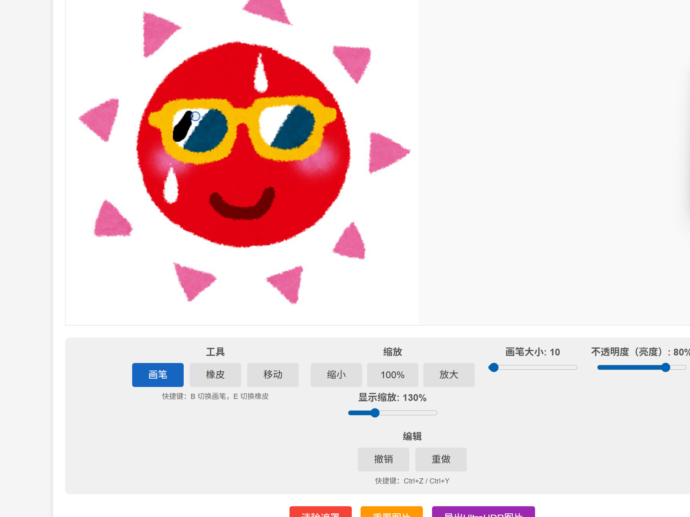
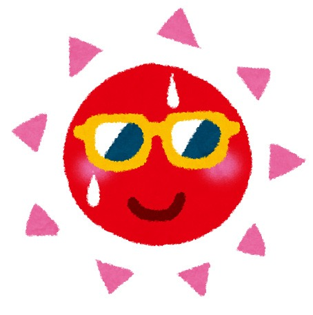

# UltraHDR图像处理工具 ultraHDR_Tool

这是一个给普通图片加上简单UltraHDR效果的工具。





## 工具地址

[https://reed-overflow.github.io/ultraHDR_Tool/](https://reed-overflow.github.io/ultraHDR_Tool/)

## 功能特性

- 上传图片并绘制黑白遮罩
- 使用gainmap-js库生成真正的UltraHDR格式JPG图片
- 支持在支持HDR的设备上呈现增强的动态范围效果

## 安装步骤

1. 克隆或下载此项目到本地

2. 进入项目目录
```bash
cd ..../ultraHDR_Tool
```

3. 安装依赖包
```bash
npm install
```

## 运行项目

```bash
npm start
```

or 

```bash
npm run dev
```

## 打包静态网页

```bash
npm run build
```

打包后会在 `dist/` 下生成静态网页文件，包含 `index.html`、`style.css` 和打包后的 `script.js`。

4. 打开浏览器，访问 http://localhost:3000 查看应用

## 使用说明

1. 点击"选择图片"按钮上传一张图片
2. 使用鼠标在图片上绘制黑白遮罩（黑色表示需要增强的区域，白色表示保持不变的区域）
3. 调整画笔不透明度以控制遮罩效果
4. 点击"导出UltraHDR"按钮生成并下载UltraHDR格式的JPG图片

## 注意事项

- UltraHDR格式的图片需要在支持HDR的设备上才能显示其全部效果